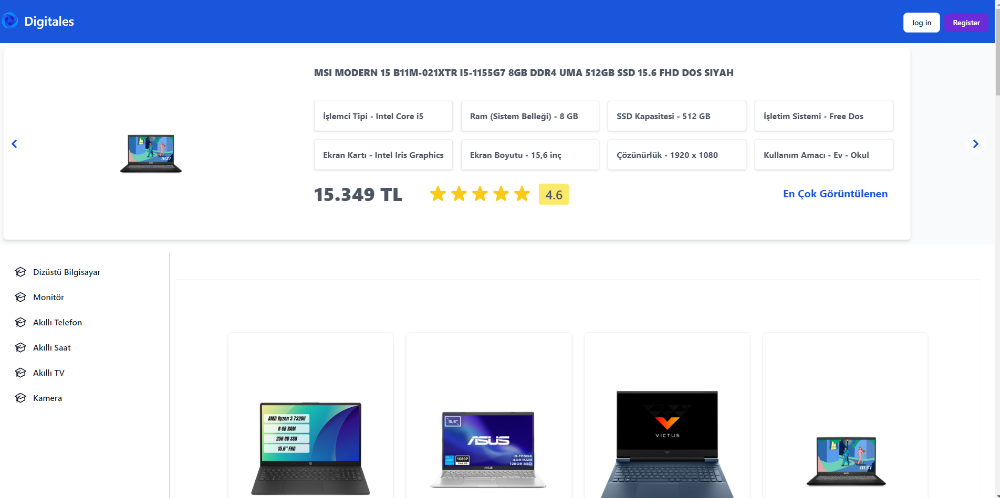
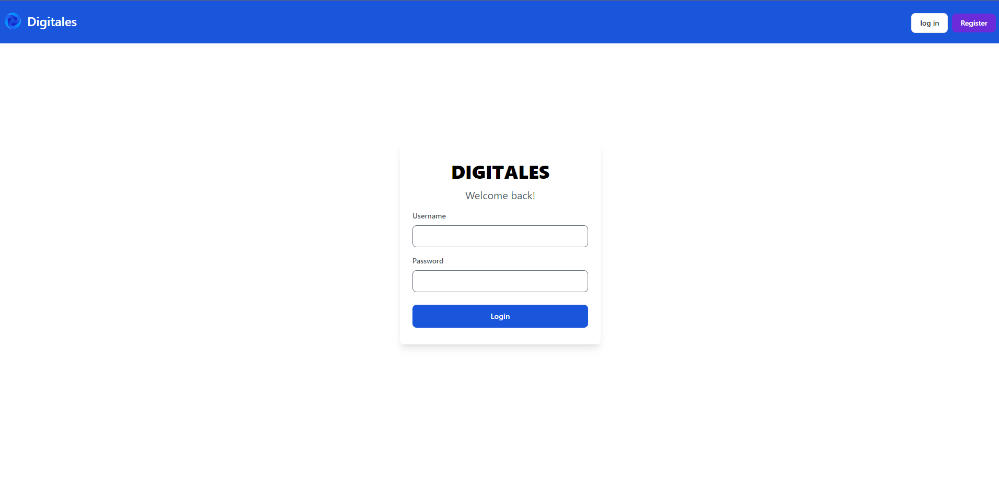
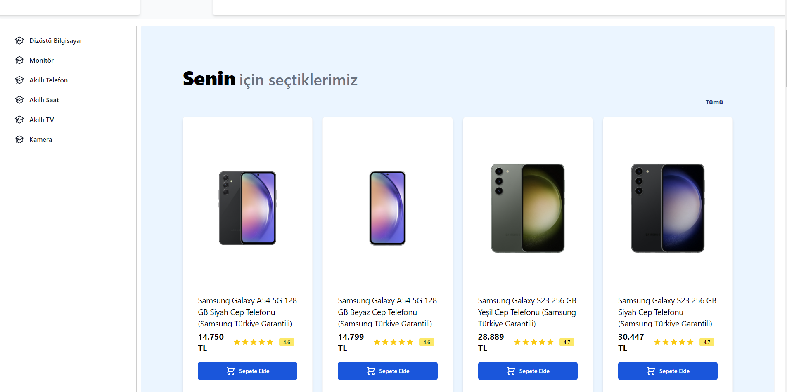
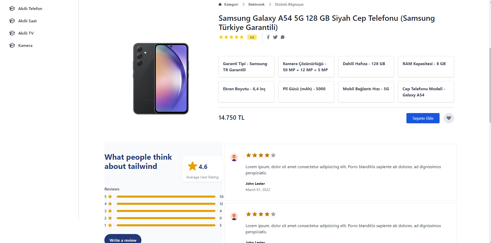

# Recommendation System for Digitales E-Commerce Products


* Bu README dosyası, projenin tanıtımı, kurulum talimatları, kullanım kılavuzu ve diğer önemli bilgileri içerir.

## Proje içeriği

* Kullanıcı kaydı ve girişi
* Giriş yapan kullanıcın görüntülemiş olduğu ürünler ile benzerlik gösteren ürünleri, benzerlik matrisi skoruna göre ürün önermeleri yapmaktadır
* Toplamda 6 category bulunmaktadır
    * Dizüstü Bilgisayar  (161)
    * Monitör  (120)
    * Akkıllı Telefon  (118)
    * Akıllı Saat  (117)
    * Akıllı TV  (68)
    * Kamera  (48)


<br>


<br>


<br>


<br>



<br>


<br>


## Hazır Kurulum
Projenin veri tabanında gerekli dosyalar bulunduğundan sadece sanal ortam (terciğen) kulup proje çalışmaya hazır olacaktır.

```bash
python manage.py runserver
```

<br>

## Baştan Kurulum
Burada projeyi sıfırdan kurabiliriz.

```bash
git clone https://github.com/miracyuzakli/digitales.git
```

```bash
cd digitales
```

```bash
python -m venv venv
source venv/bin/activate  # Linux veya macOS
# venv\Scripts\activate  # Windows
```

```bash
pip install -r requirements.txt
```

```bash
python manage.py migrate
python manage.py runserver
```

```bash
python manage.py loaddata fixtures/products_data.json
```

```bash
python manage.py runserver
```